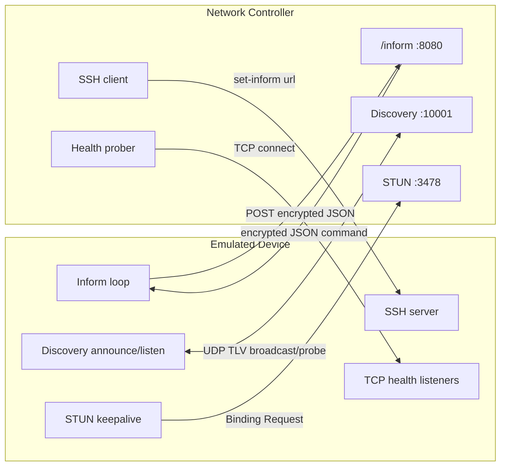
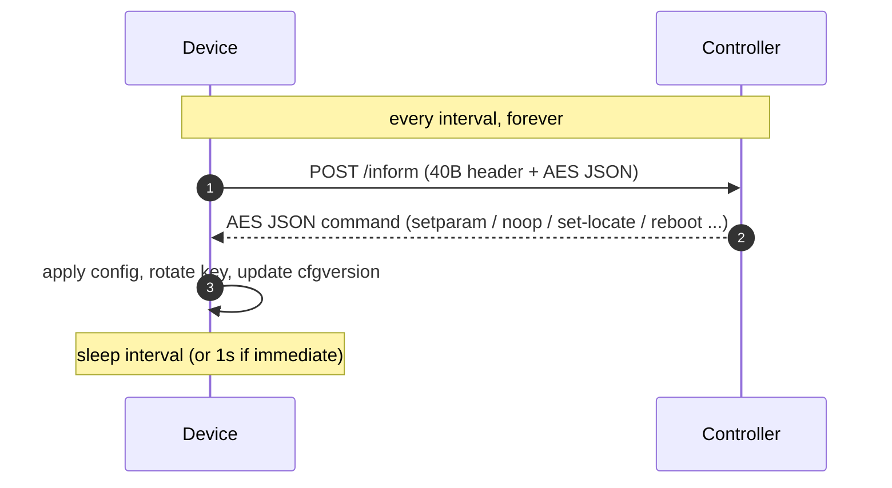
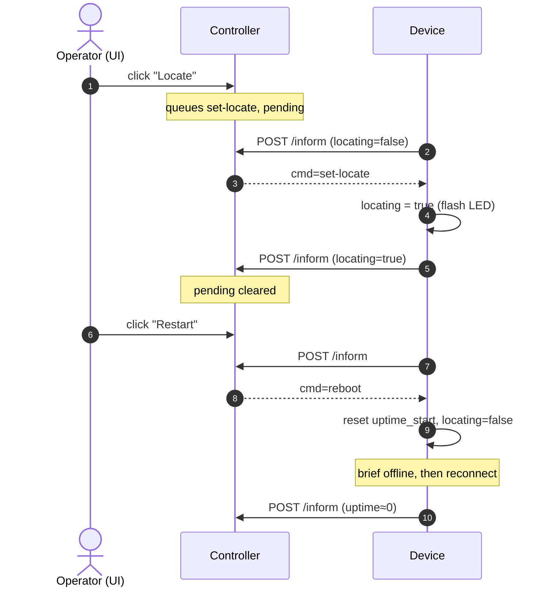
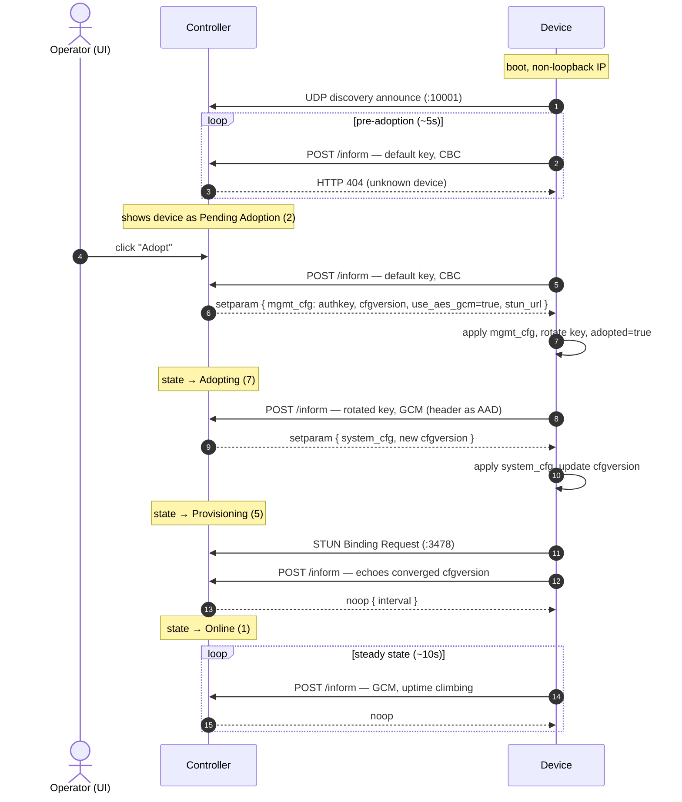

# Device Adoption & Inform Protocol — Implementation Reference

This document describes everything required to implement an **emulated network
device (switch / access point / gateway)** that a network controller will
discover, adopt, provision, and keep **Online**. It is written so the behavior
can be re-implemented from scratch in any language.

The implementation in this repository lives in the `device_emulator` package and
is driven by `device_emulator_daemon.py`. This document captures the wire
formats, endpoints, cryptography, state machine, and timing behavior independent
of that implementation.

> The full lifecycle achievable is
> `Pending Adoption → Adopting → Provisioning → Online`.

---

## 1. Big picture

A device talks to the controller using two main channels:

1. **Layer-2/UDP discovery** (port `10001`) — lets the controller find the device
   on the LAN and show it as "ready to adopt".
2. **HTTP "inform"** (controller TCP port `8080`, path `/inform`) — the primary
   control channel. The device POSTs a binary, AES-encrypted, JSON payload; the
   controller replies with a binary, AES-encrypted, JSON command. This runs on a
   periodic loop forever.

Two **auxiliary** channels are used to make the device look healthy and reachable:

3. **STUN** (UDP, default port `3478`) — NAT/reachability keepalive. The device
   periodically sends STUN binding requests to the controller's STUN URL.
4. **SSH** (TCP port `22`) — the controller may SSH into the device to push a
   `set-inform` URL during some adoption flows. Optional but recommended.
5. **TCP health probes** (e.g. ports `80`/`443`) — the controller may open TCP
   connections to verify the device is up. Accepting connections is enough.

### 1.1 Channels at a glance



The inform loop is the only **required** channel for full adoption; the other
four make the device look reachable and support controller-driven flows.



### Critical environment requirement

The device's **advertised IP and the controller URL must NOT be loopback**
(`127.0.0.1`). If a device informs from / advertises `127.x.x.x`, the controller
permanently returns **HTTP 404** to every pre-adoption inform and the device can
never be adopted. Use a real LAN/host-only interface IP (e.g. `192.168.56.1`).

Likewise the discovery **announce must egress the interface that faces the
controller**. On a multi-homed host prefer a subnet-directed broadcast
(`services.discovery_target`, e.g. `192.168.56.255`) and bind the announce socket
to the device's host-facing source IP (`services.discovery_bind_ip`). The limited
broadcast `255.255.255.255` follows the host's *default* broadcast route and
often leaves via the wrong NIC. See §9.3.

---

## 2. Endpoints & ports summary

| Purpose            | Proto | Port (default) | Direction              | Notes |
|--------------------|-------|----------------|------------------------|-------|
| Inform             | HTTP  | 8080           | device → controller    | `POST /inform`, binary body |
| Discovery          | UDP   | 10001          | both (broadcast)       | TLV packets |
| STUN               | UDP   | 3478           | device → controller    | binding requests/keepalive |
| Management UI/API  | HTTPS | 8443           | (controller-provided)  | `mgmt_url` in config |
| SSH                | TCP   | 22             | controller → device    | optional `set-inform` push |
| Health probe       | TCP   | 80 / 443       | controller → device    | accept connection = healthy |

- **Inform URL** the device posts to: `http://<controller-ip>:8080/inform`
- **HTTP method**: `POST`
- **HTTP header**: `Content-Type: application/x-binary`
- **HTTP body**: the binary inform packet described in §4.

---

## 3. Cryptography

All inform packets (both directions) are AES-encrypted with a 128-bit key
(16 bytes, represented as 32 hex chars). Two cipher modes exist; the controller
selects GCM via configuration (see §7).

### 3.1 Keys

- **Default / unknown-device key** (used before adoption and for the very first
  adopt inform): `ba86f2bbe107c7c57eb5f2690775c712`
  - This is a fixed, well-known key the controller uses to classify unknown
    devices. Every fresh device starts with it.
- **Per-device key (`authkey`)**: during adoption the controller sends a new
  32-hex `authkey` inside the management config. After applying it, the device
  must encrypt/decrypt all subsequent informs with this rotated key.

### 3.2 AES-CBC mode

- Key: 16 bytes.
- IV: the 16-byte IV carried in the packet header (§4).
- Padding: **PKCS#7** to a 16-byte block.
- Encrypt: `AES-CBC(key, iv).encrypt(pkcs7_pad(plaintext))`.

### 3.3 AES-GCM mode (REQUIRED for a stable Online device)

This is the single most important detail for full adoption. Inform v2 GCM:

- Key: 16 bytes.
- **Nonce**: the full **16-byte IV** from the header (not 12 bytes).
- **AAD (Additional Authenticated Data)**: the **entire 40-byte packet header**
  (see §4). This is mandatory.
- Output layout in the packet body: `ciphertext || 16-byte_tag`.
- `data_len` in the header = `len(ciphertext) + 16` (tag included).

Pseudocode (encrypt):
```
header = build_header(flags|GCM, iv, data_len = len(plaintext) + 16)
cipher = AES_GCM(key, nonce = iv)
cipher.update(header)                       # AAD = full header
ciphertext, tag = cipher.encrypt_and_digest(plaintext)
packet = header + ciphertext + tag
```

Pseudocode (decrypt):
```
header   = raw[0:40]
body     = raw[40:40+data_len]
ciphertext, tag = body[:-16], body[-16:]
cipher = AES_GCM(key, nonce = iv_from_header)
cipher.update(header)                        # AAD = full header
plaintext = cipher.decrypt_and_verify(ciphertext, tag)
```

> **Failure mode if you skip the AAD:** the controller rejects every GCM inform
> with **HTTP 400**. If you then fall back to CBC, the device gets *adopted* but
> stays stuck in **state 7 (Adopting)** forever: the controller keeps pushing a
> brand-new `cfgversion` on every inform, the config never converges, and the
> reported uptime freezes. Implementing GCM-with-header-AAD is what lets the
> device progress to **state 5 (Provisioning)** then **state 1 (Online)**.

### 3.4 Optional compression

The header flags can indicate the **plaintext** was compressed before encryption:
- `zlib` (flag `0x02`) — `zlib.decompress` after decrypt / compress before encrypt.
- `snappy` (flag `0x04`) — Snappy. (This implementation does not produce it and
  raises an error if asked to decode it.)

For a minimal device you can always send uncompressed and simply support
decompressing controller replies if the zlib compression flag is set.

---

## 4. Inform packet binary format

Every inform packet (request and response) begins with a fixed **40-byte header**
followed by the (encrypted) body.

### 4.1 Header layout (big-endian, 40 bytes total)

| Offset | Size | Field            | Value / meaning |
|-------:|-----:|------------------|-----------------|
| 0      | 4    | magic            | `1414414933` (`0x544E4255`) |
| 4      | 4    | header_version   | `0` |
| 8      | 6    | MAC              | device MAC, raw 6 bytes |
| 14     | 2    | flags            | bitmask (see below) |
| 16     | 16   | IV               | random per packet; also GCM nonce |
| 32     | 4    | data_version     | `1` |
| 36     | 4    | data_len         | length of the body that follows |

Struct format string (big-endian): `>I I 6s H 16s I I`.

### 4.2 Flags bitmask

| Bit    | Name              | Meaning |
|--------|-------------------|---------|
| `0x01` | ENCRYPTED         | body is AES-encrypted (always set in practice) |
| `0x02` | COMPRESSED_ZLIB   | plaintext was zlib-compressed |
| `0x04` | COMPRESSED_SNAPPY | plaintext was snappy-compressed |
| `0x08` | AES_GCM           | use AES-GCM (else AES-CBC) |

Typical request flags: `0x01` (CBC) or `0x09` (GCM, i.e. ENCRYPTED|AES_GCM).

### 4.3 Body

- CBC: `AES-CBC(pkcs7(plaintext))`, `data_len = len(ciphertext)`.
- GCM: `ciphertext || tag(16)`, `data_len = len(plaintext) + 16`.
- Plaintext is the UTF-8 JSON document described in §5 (request) or §6 (response).

### 4.4 Parsing/validation rules

- Reject if `len(raw) < 40`.
- Reject if `magic != 1414414933`.
- Reject if `data_version != 1`.
- Reject if `len(raw) < 40 + data_len`.

---

## 5. Inform REQUEST payload (device → controller)

The plaintext is a compact JSON object (no spaces). Minimum useful field set:

```json
{
  "mac": "02:15:6d:00:00:10",
  "ip": "192.168.56.1",
  "model": "US24",
  "type": "switch",
  "serial": "FKSW02156D000010",
  "version": "6.6.61.14919",
  "short_ver": "6.6.61.14919",
  "hostname": "fake-switch-01",
  "state": 0,
  "adopted": false,
  "inform_url": "http://192.168.56.1:8080/inform",
  "cfgversion": "",
  "uptime": 42,
  "num_sta": 0,
  "guest-num_sta": 0,
  "user-num_sta": 0,
  "required_version": "",
  "port_table": [ /* see §5.2 */ ]
}
```

### 5.1 Field reference

| Field             | Type    | Notes |
|-------------------|---------|-------|
| `mac`             | string  | colon-separated lowercase MAC. Identity key. |
| `ip`              | string  | advertised device IPv4 (NOT loopback). |
| `model`           | string  | e.g. `US24`. Must be consistent across informs. |
| `type`            | string  | `switch`, `access_point`, or `gateway`. Best set explicitly in config. Fallback inference from the model prefix: `US*→switch`, `UGW*/UXG*/UDM*/UDR*/UCG*/UDW*→gateway`, other `U*`/`BZ*→access_point` (else `unknown`). |
| `serial`          | string  | any stable string; this implementation uses a class prefix (`FKSW`/`FKAP`/`FKGW`) + MAC-hex-uppercase. |
| `version`         | string  | firmware version. Use a real build for the model (e.g. `6.6.61.14919`). |
| `short_ver`       | string  | same as `version`. |
| `hostname`        | string  | device hostname. Once the operator sets a **Name** in the UI (delivered via `system_cfg`, see §7.3), echo that name here. |
| `state`           | int     | **report `0`** in the payload. The controller tracks lifecycle state itself; real devices report `0` here. |
| `adopted`         | bool    | `false` until the controller has sent the adopt/setparam config, then `true`. |
| `inform_url`      | string  | the URL the device posts to. |
| `cfgversion`      | string  | 16-hex config version. Empty/`"0000000000000000"` until the controller assigns one; thereafter echo back the latest value the controller sent (see §7). |
| `uptime`          | int     | seconds since device boot. Must keep increasing on every inform. |
| `num_sta`         | int     | connected client count (use 0). |
| `guest-num_sta`   | int     | 0 |
| `user-num_sta`    | int     | 0 |
| `required_version`| string  | `""` |
| `locating`        | bool    | locate-LED state. `false` normally; set `true` after a `set-locate` command and `false` after `unset-locate`/`reboot`. The controller clears its pending locate command once it sees this echoed (see §6.4). |
| `led_override`    | string  | `"on"`/`"off"` — current LED enable state. Reflect the `led_enabled` value pushed via `mgmt_cfg` (see §7.3). |
| `bytes` / `rx_bytes` / `tx_bytes` | int | cumulative device-level traffic counters; `bytes` = rx+tx. |
| `rx_bytes-d` / `tx_bytes-d` / `bytes-d` | int | rolling 24-hour deltas of the matching counters. |
| `bytes-r` / `rx_bytes-r` / `tx_bytes-r` | number | current short-window rates (bytes/s). |
| `system-stats` / `sys_stats` | object | CPU/mem/uptime/loadavg health blocks (see §5.4). |
| `stat`            | object  | time-series rollup keyed by class (`sw`/`ap`/`gw`), see §5.4. |
| `lldp_table` / `downlink_table` / `uplink` | array/obj | topology signals (see §5.5). |
| `jumbo_frame_enabled` | bool | current Jumbo Frames setting (from `system_cfg` `switch.jumboframes`, see §7.3). |
| `flowctrl_enabled`| bool    | current Flow Control setting (from `system_cfg` `switch.flowctrl`, see §7.3). |
| `management_vlan` | int     | current management VLAN id (from `system_cfg` `switch.managementvlan`, see §7.3). |
| `port_table`      | array   | switch port states (see §5.2). |

### 5.2 `port_table` (switches)

Provide model-consistent port metadata. For `US24`: 24 copper ports +
2 SFP. Each entry:

```json
{
  "port_idx": 1,
  "name": "Port 1",
  "enable": true,
  "port_poe": true,
  "poe_enable": true,
  "up": true,
  "speed": 1000,
  "duplex": true,
  "flowctrl_rx": false,
  "flowctrl_tx": false,
  "stp_state": "forwarding",
  "port_vlan": 1,
  "tagged_vlans": [20],
  "is_uplink": false,
  "rx_bytes": 0,
  "tx_bytes": 0,
  "rx_packets": 0,
  "tx_packets": 0
}
```

SFP ports use `"port_poe": false` and may be `"up": false`. The `name`, `enable`
and `port_poe`/`poe_enable` fields reflect operator per-port settings pushed via
`system_cfg` (see §7.3): a renamed port echoes its `name`, a disabled port reports
`enable=false`/`up=false`, and a port with PoE off reports `port_poe=false`.
`port_vlan` is the port's native (untagged) VLAN id and `tagged_vlans` lists the
VLAN ids tagged on the port — both derived from the VLAN config in `system_cfg`
(see §7.3). `tagged_vlans` is omitted when empty. `is_uplink` is set `true` on the
device's uplink port (see §5.5). Each port also carries cumulative traffic + rate
counters.

### 5.3 Handshake-only extra fields (pre/at adoption)

During the adoption handshake (device not yet fully provisioned) the device may
additionally include:

| Field               | Value | Meaning |
|---------------------|-------|---------|
| `default`           | bool  | `true` while still on factory defaults (i.e. management config not yet applied), else `false`. |
| `x_has_ssh_hostkey` | bool  | `true` — device advertises an SSH host key. |
| `inform_as_notif`   | bool  | only when emitting "notification" informs (reset flows). Usually omit. |
| `notif_reason`      | string| e.g. `set-default` when `inform_as_notif` is used. |

For the simplest reliable flow you can set `default = !mgmt_cfg_applied` and
`x_has_ssh_hostkey = true`, and omit the notif fields entirely. When handshake
mode is on and `cfgversion` is empty, it is backfilled with
`"0000000000000000"`.

### 5.4 Statistics & health blocks

Traffic and health values are synthetic but deterministic per device (seeded from
the MAC), so values look stable across runs but drift slowly to produce realistic
graphs.

- Counters are cumulative and persisted to state, so they don't reset on restart.
- `*-r` fields are short-window rates in bytes/s.
- `*-d` fields are rolling 24-hour deltas.

`system-stats` (hyphen) is a percent-based summary:
```json
{ "cpu": "4.2", "mem": "47.5", "uptime": "300", "temps": {} }
```

`sys_stats` (underscore) is raw detail:
```json
{
  "loadavg_1": "0.21", "loadavg_5": "0.18", "loadavg_15": "0.15",
  "mem_used": 127000000, "mem_total": 268435456, "mem_buffer": 6350000,
  "user-rx_bytes": 0, "user-tx_bytes": 0, "guest-rx_bytes": 0, "guest-tx_bytes": 0
}
```

`stat` is the time-series rollup the controller writes into its store. The shape
is `{"<o>": {o, oid, "<o>":mac, site_id, time, datetime, dur, ...counters}}`,
where `<o>` is `sw` (switch), `ap` (access point), or `gw` (gateway):
```json
{
  "sw": {
    "o": "sw", "oid": "02:15:6d:00:00:10", "sw": "02:15:6d:00:00:10",
    "site_id": "", "time": 1781376795123, "datetime": "2026-06-28T12:00:00Z",
    "dur": 30000,
    "rx_bytes": 0, "tx_bytes": 0, "rx_packets": 0, "tx_packets": 0
  }
}
```
Gateways add per-WAN counters keyed `wan-<field>` / `wan2-<field>`.

### 5.5 Topology signals

Topology is produced entirely from **self-reported** fields; the controller does
NOT use real on-the-wire LLDP. Four signals work together:

1. `lldp_table` — the **primary** signal: the neighbors this device "sees".
2. top-level `uplink` — a **string** equal to the device's own uplink port name
   (e.g. `"Port 1"`).
3. a matching `if_table` entry whose `name` == the `uplink` string and which
   carries `uplink_mac`.
4. `downlink_table` — parent-side hints listing devices plugged into us.

Each `lldp_table` row:
```json
{
  "chassis_id": "02:15:6d:00:00:30",
  "port_id": "eth2",
  "local_port_idx": 1,
  "local_port_name": "Port 1",
  "is_wired": true,
  "chassis_descr": "lab-gw-01"
}
```

The controller uses two independent mechanisms that key off the same top-level
`uplink` string:

* **PATH A — uplink port marking:** the controller finds the `lldp_table` entry
  whose `local_port_name` == `uplink` (and `is_wired`), reads its port index, and
  sets `is_uplink=true` on that `port_table` port.
* **PATH B — the drawn link:** the controller finds the `if_table` entry whose
  `name` == `uplink` and stores that whole entry as the device's `uplink` object.
  The UI draws the link from `uplink.uplink_mac`.

Root devices (no `uplink_mac`, e.g. the gateway) send no `uplink` string and any
stale uplink object is removed before sending.

### 5.6 Topology resolution mechanism (daemon side)

The daemon `topology:` config section computes bidirectional neighbor maps. Each
entry declares a child connected upward to a parent on specific ports:

```yaml
topology:
  - device: lab-switch-01
    uplink_device: lab-gw-01
    uplink_port: 2     # port index on the PARENT (gateway LAN port)
    local_port: 1      # port index on the CHILD (its uplink port)
```

For each child link the daemon emits:

1. Child uplink: `uplink_mac`, `uplink_remote_port`, `uplink_local_port`.
2. Parent `downlink_table` entry `{mac, port_idx}`.
3. LLDP neighbor rows on BOTH child and parent (mirrored).

References may be device names or MAC addresses.

---

## 6. Inform RESPONSE payload (controller → device)

The controller replies with the same 40-byte-header + encrypted-JSON format. The
JSON contains a command. Observed response shapes by lifecycle phase:

### 6.1 Adoption / setparam (delivers config + new key)
```json
{
  "_type": "setparam",
  "mgmt_cfg": "....multi-line key=value config....",
  "server_time_in_utc": "1781376795123"
}
```
- `_type` (a.k.a. `cmd`) = `setparam`.
- `mgmt_cfg`: newline-separated `key=value` management config (see §7).
- The device must parse `mgmt_cfg`, apply the new `authkey`, `cfgversion`, etc.,
  set its internal `adopted = true`, and switch crypto mode if asked.

### 6.2 Provisioning (full system config)
After GCM is accepted, the controller pushes the full configuration:
```json
{
  "_type": "setparam",
  "mgmt_cfg": "...",
  "system_cfg": "...",
  "blocked_sta": "...",
  "cfgversion": "afc223587b0d03d4",
  "server_time_in_utc": "..."
}
```
Response keys seen: `["_type","blocked_sta","cfgversion","mgmt_cfg","server_time_in_utc","system_cfg"]`.
This corresponds to controller lifecycle **state 5 (Provisioning)**.

### 6.3 Steady state (converged → Online)
Once the config converges, the controller stops pushing new config:
```json
{
  "_type": "noop",
  "interval": 10,
  "include_blocks": [],
  "live_update": false,
  "server_time_in_utc": "..."
}
```
Response keys: `["_type","include_blocks","interval","live_update","server_time_in_utc"]`.
`_type = noop` and **no new `cfgversion`** means the device is fully provisioned →
controller lifecycle **state 1 (Connected / Online)**.

### 6.4 Other command types the device should handle

The command is read from `cmd`, `command`, or `_type` (in that order).

| `cmd` / `_type` | Action |
|-----------------|--------|
| `setparam`      | apply `mgmt_cfg` / `system_cfg`; set `adopted=true`. Also delivers operator settings changes (Name/LED/Jumbo/Flow Control/IP) after adoption — see §7.3. |
| `set-inform`    | update `inform_url` to the provided `inform_url`/`url`. |
| `adopt`         | mark `adopted=true`. |
| `setdefault`    | factory-reset behavior: restore default authkey, clear applied config. |
| `set-locate` / `locate` | start flashing the locate LED; report `locating=true` in the next inform. |
| `unset-locate` / `stop-locate` | stop the locate LED; report `locating=false` in the next inform. |
| `noop`          | nothing; just honor `interval`. |
| `reboot` / `restart` | reboot the device: increment reboot count, reset `uptime` to ~0, clear `locating`, then reconnect. |

The UI "Locate" button sends `set-locate` (and `unset-locate` when toggled off);
the controller keeps the command **pending** until the device echoes the matching
`locating` boolean in its inform payload, so a simulator must report this field.
The "Restart" button sends `reboot`; a real device disconnects and comes back with
a fresh `uptime`, which is the signal the controller uses to confirm the reboot.



Additional top-level response fields:
- `interval` (int): seconds until next inform. Honor it (clamp to ≥1).
- `immediate` (bool): if `true`, inform again almost immediately (interval = 1).
- `x_authkey` (string, 32 hex): a directly-supplied rotated key (apply it; marks
  mgmt config applied).
- `cfgversion` (string): adopt as the new config version to echo back.
- `setparam` (object): may itself contain `mgmt_cfg` / `system_cfg`.

---

## 7. Management config (`mgmt_cfg`) format

`mgmt_cfg` is a newline-separated list of `key=value` lines. Example captured
during adoption:

```
capability=notif,fastapply-bg,notif-assoc-stat
selfrun_guest_mode=pass
cfgversion=848bbff67752ce20
led_enabled=true
stun_url=stun://192.168.56.1:3478/
mgmt_url=https://192.168.56.1:8443/manage/site/default
authkey=230a6711292318c87c3c11dd31fe05e4
use_aes_gcm=true
report_crash=true
```

Parsing rule: split each non-empty line on the **first** `=`; trim whitespace.

### 7.1 Keys the device MUST act on

| Key             | Action |
|-----------------|--------|
| `authkey` (or `x_authkey`) | 32-hex. Becomes the new AES key for all future informs. Save the previous key for fallback. Mark config as applied. |
| `cfgversion`    | 8–32 hex. Store it and **echo it back** in the next request payload's `cfgversion`. |
| `use_aes_gcm`   | `true` → switch crypto mode to **GCM** for subsequent informs (unless GCM was previously rejected/disabled). |
| `stun_url`      | `stun://host:port/` → start/redirect STUN keepalive to this target. |
| `mgmt_url`      | controller management URL (informational). |
| `led_enabled`   | `true`/`false` → toggles the LED state echoed back as `led_override`. |
| `inform_url`    | if present, update the POST target. |

### 7.2 The convergence loop (why this matters)

On **every** inform during provisioning the controller sends a setparam with a
**newly generated** `cfgversion`. The device must echo the latest received
`cfgversion` back. The controller compares what the device reports against what it
last sent:
- If they don't match → it keeps pushing setparam (device stays Adopting/Provisioning).
- Once the device successfully reports the expected `cfgversion` **using the
  correct crypto (GCM)** → the controller switches to `noop` and the device goes
  **Online**.

If GCM is broken, the controller never trusts the device's acknowledgement and the
loop never converges — this is the classic "adopted but stuck Adopting" symptom.

### 7.3 Operator settings (`system_cfg` + `mgmt_cfg`)

When an operator edits the device's **Settings** panel (Name, IP, LED, Jumbo
Frames, Flow Control, …) and clicks **Apply Changes**, the controller queues a
`setparam` with a **bumped `cfgversion`**. It typically arrives 1–2 inform cycles
later. Most settings travel in `system_cfg` (a UCI-style `key=value` blob); the LED
toggle travels in `mgmt_cfg`. The device parses them, applies the values, echoes
the new `cfgversion`, and converges back to `noop` (Online) — reflecting the new
settings in its inform payload (see §5.1).

Relevant keys:

| UI setting     | Channel      | Key(s) | Inform payload field |
|----------------|--------------|--------|----------------------|
| **Name**       | `system_cfg` | `resolv.host.1.name` | `hostname` |
| **LED**        | `mgmt_cfg`   | `led_enabled=true\|false` | `led_override` (`on`/`off`) |
| **Jumbo Frames** | `system_cfg` | `switch.jumboframes=enabled\|disabled`, `switch.mtu` | `jumbo_frame_enabled` |
| **Flow Control** | `system_cfg` | `switch.flowctrl` (present only when toggled) | `flowctrl_enabled` |
| **IP — DHCP**  | `system_cfg` | `dhcpc.1.status=enabled` | (device IP) |
| **IP — Static**| `system_cfg` | `dhcpc.1.status=disabled`, `netconf.1.ip=<addr>` | `ip` |
| **Per-port** (name/PoE/enable) | `system_cfg` | `switch.port.<N>.{name,poe,opmode,status}` | `port_table[]` entry for port `N` |
| **VLANs / port VLAN** | `system_cfg` | `switch.managementvlan`, `switch.vlan.<R>.{id,mode,status}`, `switch.vlan.<R>.port.<N>.mode` | `management_vlan`, per-port `port_vlan`/`tagged_vlans` |

Switch per-port keys (one set per port `N`, 1-based — copper then SFP):

| Key | Values | Maps to port_table field |
|-----|--------|--------------------------|
| `switch.port.N.name`   | string | `name` |
| `switch.port.N.poe`    | `auto`/`pasv24` = on, `shutdown`/`off` = off | `port_poe`, `poe_enable` |
| `switch.port.N.status` | `disabled` = administratively down (overrides opmode) | `enable=false`, `up=false` |
| `switch.port.N.opmode` | `switch` (normal) | `enable` |

Note: `switch.port.N.status` is only sent when the port is **Disabled** in the UI;
when present it takes precedence over `opmode`.

VLAN keys — VLANs are indexed by a 1-based **row** `R` (which is *not* the VLAN id;
the id is carried in `switch.vlan.R.id`):

| Key | Values | Meaning |
|-----|--------|---------|
| `switch.managementvlan` | int | management VLAN id (inform field `management_vlan`) |
| `vlan.status`           | `enabled`/`disabled` | global 802.1Q feature flag |
| `switch.vlan.R.id`      | int | VLAN id for row `R` |
| `switch.vlan.R.mode`    | `untagged`/`tagged` | default membership for all ports in this VLAN |
| `switch.vlan.R.status`  | `enabled`/`disabled` | VLAN active |
| `switch.vlan.R.port.N.mode` | `untagged`/`tagged`/`blocked` | per-port override of the VLAN's default mode |

Native/tagged resolution per port `N` (how a simulator derives `port_table` fields):
- **Native VLAN** = the VLAN whose mode for port `N` is `untagged`. An explicit
  `switch.vlan.R.port.N.mode=untagged` wins over a VLAN that is untagged only by
  its default `switch.vlan.R.mode`. If none apply, fall back to `managementvlan`.
- **Tagged VLANs** = every VLAN whose mode for port `N` resolves to `tagged`.
- The controller only emits `switch.vlan.R.port.N.mode` for ports that differ from
  the VLAN default — e.g. **Tagged VLAN Management → Block All** on a port emits a
  per-port `untagged` for the native VLAN and omits the others; **Allow All** drops
  the per-port overrides so the port inherits each VLAN's default mode.

Gateway-specific `system_cfg` keys (parsed by the gateway device class):

| Key(s) | Effect |
|--------|--------|
| `netconf.1.ip` / `wan.ip` | WAN IPv4 address |
| `netconf.1.gateway` / `wan.gateway` | WAN gateway |
| `netconf.1.netmask` / `wan.netmask` | WAN netmask |
| `netconf.1.type` / `wan.type` | WAN type (`dhcp`/`pppoe`/`static`) |
| `netconf.1.speed` / `wan.speed` | WAN link speed |
| `netconf.1.duplex` / `wan.duplex` | WAN duplex |
| `resolv.nameserver.1.server` / `wan.dns1` | primary DNS |
| `resolv.nameserver.2.server` / `wan.dns2` | secondary DNS |
| `netconf.2.ip` / `lan.ip` | LAN IPv4 address |
| `netconf.2.netmask` / `lan.netmask` | LAN netmask |
| `internet` | internet-reachable flag |

Access-point `system_cfg` keys include `radio.<band>.<attr>`,
`wireless.<id>.(ssid|channel|disabled|radio)`, and `country_code`.

Parsing rule is the same as `mgmt_cfg`: split each non-empty line on the first `=`
and trim. The blob also carries users, NTP, SSH, etc.; a simulator can ignore the
keys it doesn't model.

Example `system_cfg` excerpt (Name = `Lab-Switch-01`, Jumbo Frames off, DHCP;
port 1 renamed + PoE off, port 2 renamed + disabled):

```
# resolv
resolv.host.1.name=Lab-Switch-01
# switch
switch.jumboframes=disabled
switch.mtu=9216
switch.managementvlan=1
switch.vlan.1.id=1
switch.vlan.1.mode=untagged
switch.vlan.1.status=enabled
switch.port.1.name=Uplink-1
switch.port.1.opmode=switch
switch.port.1.poe=shutdown
switch.port.2.name=Cam-Port
switch.port.2.status=disabled
switch.port.2.opmode=switch
switch.port.2.poe=auto
# dhcpc
dhcpc.1.status=enabled
dhcpc.1.devname=eth0
# netconf
netconf.1.ip=0.0.0.0
```

---

## 8. Controller lifecycle states

The `state` integer reported by the controller's device API (`GET
/api/s/<site>/stat/device`) — NOT the value in the inform payload:

| state | Meaning            |
|------:|--------------------|
| 0     | Offline / Disconnected |
| 1     | **Connected / Online** (goal) |
| 2     | Pending Adoption   |
| 4     | Upgrading          |
| 5     | Provisioning       |
| 6     | Heartbeat missed   |
| 7     | Adopting           |

Healthy progression: `2 → 7 → 5 → 1`.

> **Adoptable vs. "Managed by Another Console".** Being in **Pending Adoption
> (2)** is not by itself enough for the controller to offer an **Adopt** action.
> The controller only treats a pending device as adoptable when it *also* reports
> `default: true` in its inform payload (factory-default state). A pending device
> that does **not** report `default: true` is filed under **"Managed by Another
> Console"** and shows no Adopt button. To get the Adopt action, run the device
> in the **adoptable handshake profile**: discovery `packet_type = 0x02` *and*
> handshake mode on, which makes the inform emit `default = !mgmt_cfg_applied`
> (see §5.3 and §9.3).

```mermaid
stateDiagram-v2
    [*] --> Offline: device not yet seen
    Offline --> Pending: discovery + pre-adopt inform (HTTP 404 is normal)
    Pending --> Adopting: operator clicks Adopt; controller sends setparam (new authkey, use_aes_gcm)
    Adopting --> Provisioning: device informs with rotated key over GCM; controller pushes system_cfg
    Provisioning --> Online: device echoes converged cfgversion; controller replies noop
    Online --> Online: steady-state noop informs (uptime climbs)
    Online --> HeartbeatMissed: informs stop arriving
    HeartbeatMissed --> Online: informs resume
    HeartbeatMissed --> Offline: timeout
    Online --> Upgrading: firmware upgrade command
    Upgrading --> Provisioning: reboot into new firmware
    Online --> Pending: setdefault (forget / factory reset)

    note right of Adopting
        state 7
        Stuck here forever if GCM
        is wrong (no header AAD)
    end note
```



State numbers: 0 Offline, 1 Online, 2 Pending, 4 Upgrading, 5 Provisioning,
6 HeartbeatMissed, 7 Adopting.

---

## 9. UDP discovery (port 10001)

Discovery uses a simple **TLV** (type/length/value) packet. The device both
broadcasts announcements and answers probes.

### 9.1 Packet framing

```
byte 0      : packet_type  (0x06 managed-style, 0x02 reset-style, etc.)
byte 1      : flags        (0x00)
bytes 2-3   : total_len    (big-endian uint16 = length of the TLV block)
bytes 4..   : TLV fields
```

### 9.2 TLV field framing

Each field: `type(1 byte) | length(2 bytes BE) | value(length bytes)`.

| Type   | Field    | Value encoding |
|--------|----------|----------------|
| `0x01` | MAC      | 6 raw bytes |
| `0x02` | IP       | 4 raw bytes (IPv4) |
| `0x03` | firmware | UTF-8 string |
| `0x0A` | hostname | UTF-8 string |
| `0x0B` | model    | UTF-8 string |
| `0x0C` | serial   | UTF-8 string |

### 9.3 Behavior

- **Announce**: every ~10s broadcast a discovery packet (set the socket
  `SO_BROADCAST` option) and include the TLVs above. On a multi-homed host the
  broadcast **target** and **source interface** matter:
  - Send to a **subnet-directed** broadcast that routes toward the controller
    (e.g. `192.168.56.255:10001`), configured via `services.discovery_target`.
    The limited broadcast `255.255.255.255` follows the host's *default*
    broadcast route, which on a multi-NIC VM often egresses the wrong interface
    (e.g. a NAT NIC) and never reaches the controller's subnet.
  - Bind the announce socket to the device's host-facing source IP via
    `services.discovery_bind_ip` (the daemon defaults this to the first device's
    non-loopback `local_ip`) so the packet leaves the correct interface.
- **Listen**: bind UDP `0.0.0.0:10001`. When a probe arrives (first byte in
  `{0x01,0x02,0x04,0x08}`), reply to the sender with the device's discovery packet.
- `packet_type` of the announce can be `0x06` (managed) or `0x02`
  (reset/adoptable). Use `0x02` together with the inform handshake (`default:
  true`, see §5.3 / §8) to make the controller offer **Adopt**; `0x06` presents
  the device as managed ("hold reset to adopt").
- Optional sniffing logs both RX and TX packets as NDJSON with decoded TLVs.

---

## 10. STUN keepalive (UDP 3478)

After adoption the controller supplies `stun_url=stun://<ip>:3478/`. The device
should periodically (e.g. every interval) send a **STUN Binding Request** to that
address. This is standard RFC 5389 framing:

### 10.1 Binding request
```
bytes 0-1 : message type   = 0x0001 (Binding Request)
bytes 2-3 : message length = length of attributes
bytes 4-7 : magic cookie   = 0x2112A442
bytes 8-19: transaction id = 12 random bytes
bytes 20..: attributes
```
Attributes the device sends:
- `SOFTWARE` (type `0x8022`): UTF-8 string `network/<mac>`, padded to a 4-byte
  boundary. Only included when a MAC is supplied. (Note: some controllers log
  this as an "unsupported attribute" and drop it; it is harmless.)
- `CHANGE-REQUEST` (type `0x0003`, length 4, value 0): always appended.

### 10.2 Binding response (if you also act as a STUN server)
For NAT traversal the controller may send the device a Binding Request; reply with
a **Binding Success** (`0x0101`) containing an `XOR-MAPPED-ADDRESS` (type `0x0020`):
```
attr value: reserved(1)=0 | family(1)=0x01 | xport(2) | xaddr(4)
  xport = source_port  XOR (magic_cookie >> 16)
  xaddr = source_ip(4) XOR magic_cookie(4 bytes big-endian)
```
Binding success header uses message type `0x0101` and echoes the transaction id.

STUN is a reachability nicety; binding the local 3478 server may fail on some
hosts (e.g. access-denied) — that is non-fatal.

---

## 11. SSH emulation (TCP 22)

Some adoption flows have the controller SSH into the device and run a
`set-inform` command to point it at the controller. A minimal emulation:

- Accept password auth for the configured user (default `device`/`device`).
- Support `exec` and interactive `shell` channels.
- When a command matches `set-inform <url>` (or `syswrapper.sh set-inform <url>`),
  extract the URL and update the device's `inform_url`, then enable informing.
- Return plausible canned output for common commands (`info`, `cat /etc/version`,
  `cat /proc/uptime`, `uname -a`, `mca-cli-op ... info`, `reboot`, etc.).

This is optional when the device already informs proactively, but it covers
controller-driven adoption paths.

---

## 12. TCP health probes (ports 80/443)

The controller may open TCP connections to the device on common ports to confirm
it's alive. Simply listening and accepting connections is sufficient. For HTTP
ports (80/8080) you may return a tiny `200 OK`:
```
HTTP/1.1 200 OK
Content-Type: text/plain
Connection: close
Content-Length: 3

ok
```

---

## 13. Timing & inform loop

The device runs an endless loop:

1. Build the request payload (§5) with current `uptime`, `cfgversion`, `adopted`.
2. Encrypt with the current key + mode (§3) into a packet (§4).
3. `POST /inform`.
4. On success, decrypt and process the response (§6): apply config, rotate key,
   update `cfgversion`, set `adopted`, compute next interval.
5. Sleep `interval` seconds (honor controller `interval`/`immediate`), repeat.

Recommended timing/robustness rules:
- **Pre-adoption** (`adopted == false`): retry quickly — every ~5s — so the
  controller's adopt action doesn't time out. Pre-adopt `404` is **normal** and
  expected until an operator clicks "Adopt" in the UI.
- **Post-adoption**: use the controller-provided `interval` (default ~10s for
  keepalive), clamp to ≥1s. When `post_adopt_keepalive` is set, the next interval
  is clamped down to `post_adopt_interval`.
- After a `set-inform` change or `immediate=true`, inform again in ~1s.
- On `HTTP 400` while in **GCM** mode: if you cannot get GCM right, you may fall
  back to CBC (`gcm_disabled = true`) — but note the device will then stay stuck
  in Adopting (§3.3). The correct fix is implementing GCM-with-header-AAD.
- On post-adoption `HTTP 404` (auth-key drift) in handshake mode: retry once with
  the **previous** key and once with the **default** key before giving up.

### State a device must persist across the loop
- current `auth_key` and `previous_auth_key`
- `aes_mode` (cbc/gcm) and `gcm_disabled`
- `cfgversion`
- `adopted`, `mgmt_cfg_applied`
- `controller_url`, `stun_url`
- `uptime_start` (so uptime keeps climbing)
- `locating`, `reboot_count`, `led_enabled`, `device_name`
- traffic counter snapshots (device-level + per-port/per-radio/per-WAN)

When persistence is enabled, this state is written per-MAC to a JSON file under
`data/` via an atomic temp-file replace, so the device resumes its identity and
counters across restarts. Without persistence, each process restart loses the
rotated `authkey`, so to re-test adoption from scratch you must use a **fresh
MAC** (the controller remembers the old one and its key).

---

## 14. End-to-end adoption walkthrough (happy path)

1. Device boots; advertises via UDP discovery (port 10001) from a non-loopback IP.
2. Device POSTs `/inform` encrypted with the **default key** in **CBC**, reporting
   `default: true` (adoptable handshake profile). Controller replies `404` (no
   config yet) → controller shows it as **Pending Adoption (2)** with an **Adopt**
   action. A pending device that does *not* report `default: true` is shown as
   *Managed by Another Console* with no Adopt button (see §8).
3. Operator clicks **Adopt** in the controller UI.
4. Next inform: controller replies `setparam` with `mgmt_cfg` containing a new
   `authkey`, a `cfgversion`, `use_aes_gcm=true`, `stun_url`, etc. Device applies
   them, sets `adopted=true`. State → **Adopting (7)**.
5. Device switches to the rotated key and **GCM** (with header-AAD). Controller
   accepts the GCM inform and pushes the full `system_cfg`. State → **Provisioning (5)**.
6. Device echoes the converged `cfgversion`. Controller replies `noop`. State →
   **Online (1)**. Uptime now advances; device stays Online as long as it keeps
   informing.



> The single most common failure: GCM without the 40-byte header as AAD →
> controller rejects with HTTP 400 → device falls back to CBC and is stuck at
> **Adopting (7)** with a churning `cfgversion`. See §3.3.

---

## 15. Quick checklist for a working implementation

- [ ] Non-loopback device IP and controller URL.
- [ ] 40-byte big-endian header with magic `1414414933`, data_version `1`.
- [ ] AES-CBC with PKCS#7 and header IV.
- [ ] **AES-GCM with the 40-byte header as AAD and the 16-byte IV as nonce.**
- [ ] Start with default key `ba86f2bbe107c7c57eb5f2690775c712`, CBC.
- [ ] Parse `mgmt_cfg`; rotate `authkey`; switch to GCM on `use_aes_gcm=true`.
- [ ] Echo the latest `cfgversion` back every inform.
- [ ] Report payload `state=0`; keep `uptime` increasing.
- [ ] Periodic inform loop honoring controller `interval`.
- [ ] UDP discovery announce + respond on port 10001.
- [ ] Announce with `packet_type 0x02` and report `default: true` pre-adoption
      (handshake profile) so the controller offers **Adopt** rather than
      "Managed by Another Console".
- [ ] Announce toward the controller's subnet (`discovery_target`) from the
      correct source interface (`discovery_bind_ip`).
- [ ] STUN keepalive to `stun_url` after adoption.
- [ ] (Optional) SSH `set-inform` handling and TCP health listeners.
- [ ] Keep the process running through the whole lifecycle; never restart mid-adoption.

---

## Appendix A — Reference constants

```
PACKET_MAGIC      = 1414414933   # 0x544E4255
HEADER_VERSION    = 0
DATA_VERSION      = 1
HEADER_SIZE       = 40
FLAG_ENCRYPTED        = 0x01
FLAG_COMPRESSED_ZLIB  = 0x02
FLAG_COMPRESSED_SNAPPY= 0x04
FLAG_AES_GCM          = 0x08
STUN_MAGIC_COOKIE = 0x2112A442
DEFAULT_AUTH_KEY  = "ba86f2bbe107c7c57eb5f2690775c712"
DISCOVERY_PORT    = 10001
INFORM_PATH       = "/inform"
CONTENT_TYPE      = "application/x-binary"
```

## Appendix B — Header struct (big-endian)

```
> I        magic            (4)
  I        header_version   (4)
  6s       mac              (6)
  H        flags            (2)
  16s      iv               (16)
  I        data_version     (4)
  I        data_len         (4)
= 40 bytes
```

## Appendix C — Device classes

| Class | `type` | model prefix | serial prefix | `stat` o | hostname pattern |
|-------|--------|--------------|---------------|----------|------------------|
| Switch        | `switch`        | `US*` (e.g. `US24`)            | `FKSW` | `sw` | `fake-switch-NN` |
| Access point  | `access_point`  | `U*` / `BZ*` (e.g. `U7P`)      | `FKAP` | `ap` | `fake-accesspoint-NN` |
| Gateway       | `gateway`       | `UGW*`/`UXG*`/`UDM*` (e.g. `UGW3`) | `FKGW` | `gw` | `fake-gateway-NN` |

> Models are real catalog codes (e.g. `US24`, `U7P`, `UGW3`); the controller
> validates the `model` field against its hardware catalog and silently drops
> discovery / 404s informs for unknown codes. Type inference from the model
> prefix is only a fallback — prefer setting `type` explicitly in config.

Type-specific payload extras:

- **Switch:** `port_table`, singular `uplink`, `jumbo_frame_enabled`,
  `flowctrl_enabled`, `management_vlan`.
- **Access point:** `radio_table`, `vap_table`, `radio_table_stats`,
  `uplink_table`, singular `uplink`, `ethernet_table`, `antenna_table`.
- **Gateway:** `if_table`, `network_table`, `uplink_table`, singular `uplink`,
  `wan1`/`wan2` counter objects, `internet`, `dns`, `ipv4_active_leases`.
